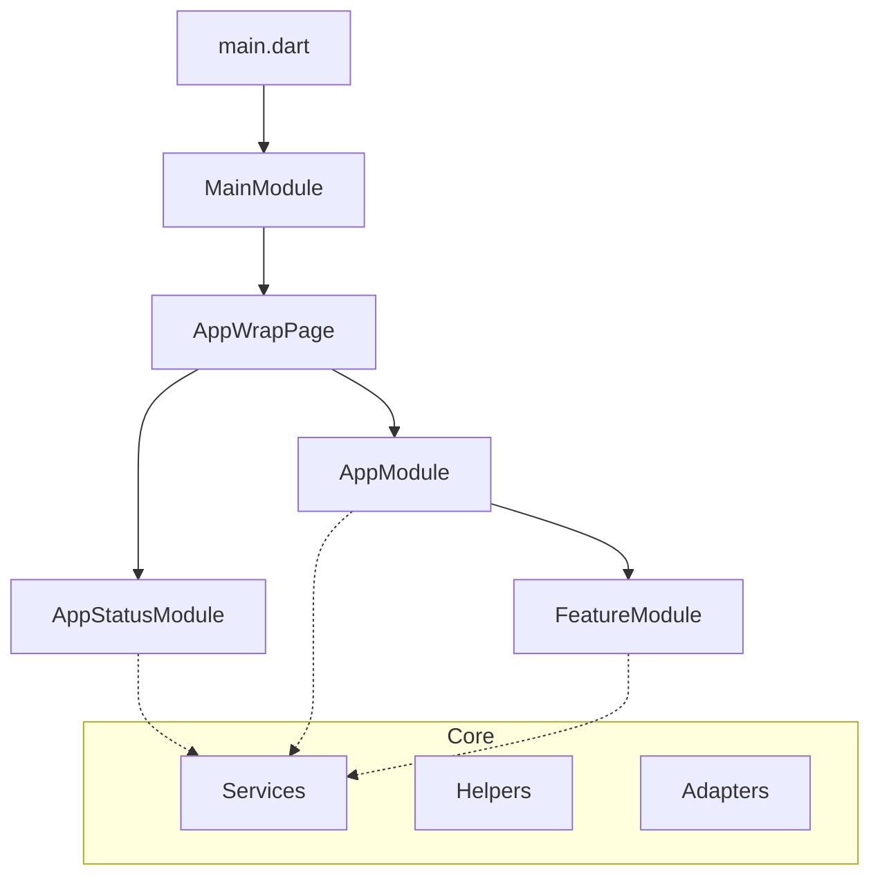
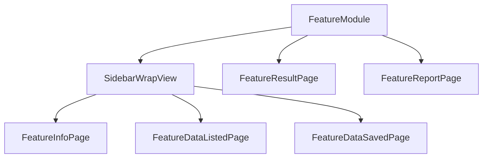

<!-- Context: project-intelligence/concepts/architecture | Priority: critical | Version: 1.0 | Updated: 2026-05-04 -->

# Architecture - Clean Architecture Pattern

**Core Concept**: Clean Architecture with unidirectional data flow for Flutter desktop.

---

## Directory Structure

```
lib/src/
├── core/           # Services, helpers, adapters
├── domain/         # Models, enums, converters
├── modules/        # Feature modules
│   ├── app/        # Main app module
│   ├── features/   # Feature aggregator
│   └── {feature}/  # Individual feature module
└── shared/         # Reusable widgets, views, styles
    ├── widgets/    # buttons/, cards/, charts/, top_bar/, sidebar/
    ├── views/      # Reusable views
    └── styles/     # Text styles, PDF styles
```

---

## Application Flow



## FeatureModule Route Structure



**Route Patterns**:
- **Layout pages** (`/info`, `/data/listed`, `/data/saved`): Use `SidebarWrapView` with side navigation
- **Full-screen pages** (result, report): Independent, full-screen routes

---

## Key Points

1. **Clean Architecture**: UI → Domain → Data flow
2. **State**: Cubit + sealed State classes (Equatable)
3. **Modules**: Each feature area has its own Module
4. **Models**: JSON-serializable with code generation
5. **Services**: Business logic services in `core/services/`

---

## Module Pattern

```dart
class FeatureModule extends Module {
  @override
  List<Bind> get binds => [
    Bind.lazySingleton<FeatureCubit>((i) => FeatureCubit(
      featureService: i<IFeatureService>(),
    )),
  ];

  @override
  List<ModularRoute> get routes => [
    ModuleRoute("/feature", module: FeatureModule()),
  ];
}
```

---

## Reference

- Full structure: `lib/src/` directory
- Feature module template: `guides/feature-checklist.md`
