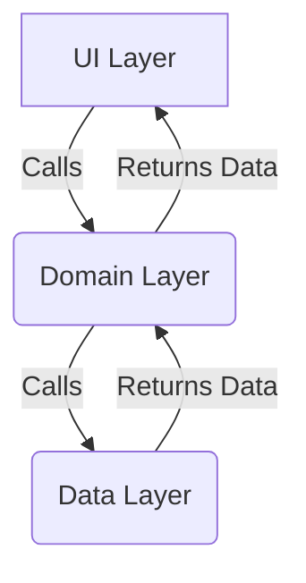
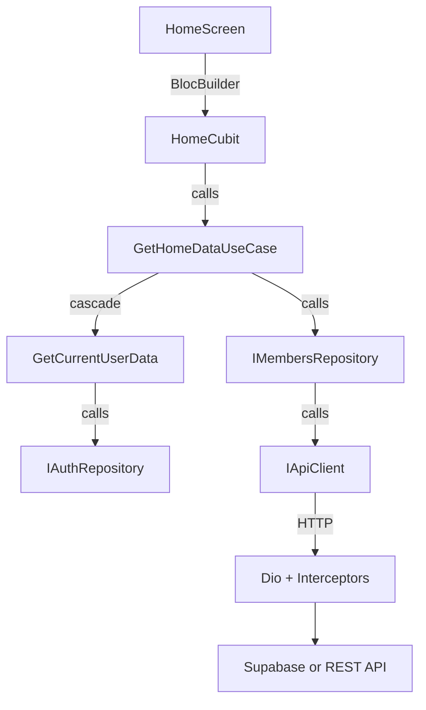

<!-- Context: project-intelligence/concepts/architecture | Priority: critical | Version: 4.1 | Updated: 2026-07-02 -->

# Architecture — BlocoNaRua

**Core Concept**: Clean Architecture (UI → Domain → Data) with Cubit/Provider DI and a hybrid Supabase + REST backend. Mobile-first Flutter app, no desktop layout.

---

## Conceptual Overview (Clean Architecture)

The project follows **Clean Architecture** with a unidirectional dependency rule: outer layers depend on inner layers, never the reverse.

**Three layers**:

- **UI Layer** — presentation; widgets + Cubits (the project calls them "Cubits", not "ViewModels")
- **Domain Layer** — business logic; entities (`@freezed`) + use cases
- **Data Layer** — infrastructure; repositories + API clients

**Data flow (unidirectional)**:



> For an older text-only overview, see `architecture_summary.md` (project root) and `.tmp/architecture_summary.md`. They are superseded by this document.

---

## Layered Structure (lib/)

```
lib/
├── config/        # DI container (single file: dependencies.dart)
├── core/          # Cross-cutting: ApiError, EntityBase, IRepositoryBase
├── data/          # Implementations: api clients, repositories, services (+ shared base classes: RepositoryBase)
├── domain/        # Pure Dart: entities (freezed) + use cases
├── routing/       # GoRouter config + Routes constants
├── ui/            # Feature-first: cubit + widgets per screen
├── main.dart      # Bootstrap: dotenv → Supabase → Providers → runApp
├── main_app.dart  # MaterialApp.router + theme + auth gate
└── driver_main.dart  # Flutter Driver entry for E2E
```

**Key deviations** from generic Clean Arch:
- ❌ **No `lib/src/`** — flat `lib/` (Dart convention)
- ❌ **No `lib/src/modules/`** — UI uses feature folders, NOT Modular
- ✅ **`config/dependencies.dart`** is the SINGLE DI file (all `Provider`s)

---

## Detailed Flow — Home Screen (end-to-end walkthrough)

Below is the canonical 5-step walkthrough for the Home dashboard. Each arrow represents an `AsyncResult<T>` return on the way back.

### 1. UI Layer — `HomeScreen` widget
- `HomeScreen` is a `StatelessWidget` that listens to `HomeCubit` via `BlocBuilder<HomeCubit, HomeState>`.
- When the screen is initialized (in `router.dart`'s `pageBuilder`), `HomeCubit.loadHomeData()` is auto-triggered.

### 2. UI Layer — `HomeCubit`
- Holds state (`HomeStatus` enum + `blocks`, `meetings`, `errorMessage`).
- On `loadHomeData`: emits `loading`, then calls `GetHomeDataUseCase.getCarnivalBlocks()` + `getMeetings()` in parallel via `Future.wait`.

### 3. Domain Layer — `GetHomeDataUseCase`
- Orchestrates data fetching. First calls `GetCurrentUserData` (cascading UseCase) to fetch `MembersEntity`.
- Then calls `IMembersRepository.getBlocksByMemberId(userId)` to fetch user's carnival blocks.
- For meetings, calls `IMembersRepository.getMeetingsByMemberId(userId)`.

### 4. Data Layer — Repositories (`IMembersRepository`, etc.)
- Abstract the data source. Implementations wrap API clients and translate `DioException` → `ApiError` via `ApiError.fromDioException`.
- Return `AsyncResult<List<T>>` (= `Future<Result<List<T>>>` from `result_dart`).

### 5. Data Layer — API Clients (`IBaseApiClient`, `IMembersApiClient`, etc.)
- Use `IBaseApiClient` (which wraps Dio with interceptors) to make HTTP calls.
- Parse JSON → entity (via `entity.fromJson` from `@freezed` codegen).

---

## Compact Directory Tree

```
lib/
├── config/dependencies.dart          # All Providers registered here
├── core/{api_error, error_types, error_messages, entity_base, irepository_base}.dart
├── data/
│   ├── repositories/{feature}/{i{feature}_repository, {feature}_repository}.dart
│   ├── repositories/base/repository_base.dart        # Base repository class (data layer)
│   └── services/
│       ├── api/base/{base_api_client, dio_error_interceptor, ibase_api_client}.dart
│       ├── api/{feature}/{i{feature}_api_client, {feature}_api_client}.dart
│       ├── auth/auth_api_client.dart
│       └── shared_preferencies_service.dart   # [sic]
├── domain/
│   ├── entities/{feature}/{feature}_entity.dart      # @freezed sealed
│   └── use_cases/{feature}/{action}_use_case.dart
├── routing/{routes.dart, router.dart}
└── ui/
    ├── core/{colors, theme, widgets}/
    └── {feature}/{cubit, widgets}/
```

See `lookup/ui-organization.md` for the full `lib/ui/` tree.

---

## Data Flow (Implementation Diagram)



**Constants**:
- All async operations return `AsyncResult<T>` (from `result_dart`)
- Errors never throw — always wrapped in `Result.failure(...)`
- Cubits translate `ApiError.userMessage` → emit `*Status.failure`
- Each arrow returning to `D` / `C` / `B` is an `AsyncResult<T>`

---

## DI Pattern (Provider)

`lib/config/dependencies.dart` exports `List<SingleChildWidget> get providers`:

```dart
var baseOptions = BaseOptions(
  baseUrl: dotenv.env['API_URL']!,
  receiveDataWhenStatusError: true,
  validateStatus: (s) => s != null && s >= 200 && s < 500,
);

var supabaseClient = Supabase.instance.client;

List<SingleChildWidget> get providers => [
  Provider<SupabaseClient>(create: (_) => supabaseClient),
  Provider<IBaseApiClient>(create: (_) => BaseApiClient(
    clientFactory: (opts) {
      final client = Dio(opts);
      client.interceptors.add(DioErrorInterceptor());
      client.interceptors.add(PrettyDioLogger(...));
      return client;
    },
    options: baseOptions,
  )),
  Provider<IMembersRepository>(create: (c) =>
    MembersRepository(membersApiClient: c.read())),
  // ... ~15 providers total
];
```

Page-scoped cubits (e.g., `HomeCubit`) are NOT in this list — see `examples/router-slide-transition.md`.

---

## Routing

- **Library**: `go_router` v17 with declarative `GoRoute` list
- **Transitions**: Custom slide (left-to-right, `Curves.easeOutCubic`)
- **Auth gate**: `_redirect` checks `IAuthRepository.validateSession()`
- **Errors**: `errorBuilder` → `NotFoundScreen` or `ErrorScreen`
- **Detail routes**: parse `state.pathParameters['id']!`, pass to cubit constructor

See `examples/router-slide-transition.md` for the full template.

---

## Related Documentation (historical context)

| Source | Purpose | Status |
|--------|---------|--------|
| `.tmp/architecture_summary.md` | Original conceptual overview (43 lines, migrated-from root) | Kept for git diff; content merged here |
| `architecture_summary.md` (project root) | Older text-only overview (43 lines) | Kept for git diff; content merged here |
| `concepts/architecture.md` (this file) | **Authoritative** — conceptual + implementation | Current |

---

## Cross-References

- `concepts/stack.md` — Versions & rationale
- `concepts/bloc-state-pattern.md` — Cubit state shape
- `concepts/dio-pipeline.md` — Interceptor chain
- `concepts/result-handling.md` — AsyncResult pattern
- `concepts/freezed-entity.md` — Entity generation
- `technical-component-pattern.md` — Per-layer responsibilities
- `examples/home-feature-flow.md` — file-by-file walkthrough
- `lookup/entities.md`, `lookup/use-cases.md`, `lookup/routes.md`, `lookup/cubits.md`
