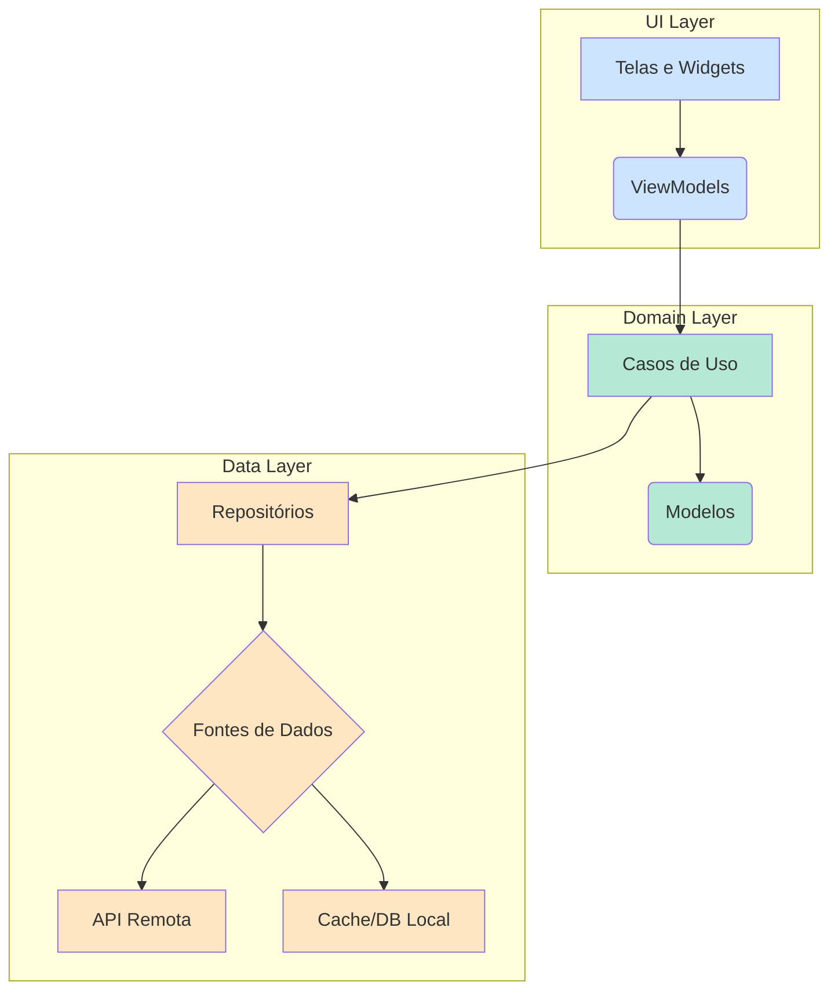

**User:**

<task>
me ajude a entender esse projeto de flutter
</task>
<environment_details>
# VSCode Visible Files
app\lib\config\dependencies.dart

# VSCode Open Tabs
app/lib/main_development.dart,app/lib/config/dependencies.dart

# Current Time
Current time in ISO 8601 UTC format: 2025-08-11T14:26:43.886Z
User time zone: America/Sao_Paulo, UTC-3:00

# Current Cost
$0.00

# Current Mode
<slug>ask</slug>
<name>❓ Ask</name>
<model>gemini-2.5-flash-lite-preview-06-17</model>


# Current Workspace Directory (c:/Repos/samples/compass_app) Files
app/
app/.metadata
app/analysis_options.yaml
app/android/
app/android/app/
app/android/app/src/
app/android/app/src/debug/
app/android/app/src/main/
app/android/app/src/main/java/
app/android/app/src/main/java/io/
app/android/app/src/main/java/io/flutter/
app/android/app/src/main/java/io/flutter/plugins/
app/android/app/src/main/kotlin/
app/android/app/src/main/kotlin/com/
app/android/app/src/main/kotlin/com/example/
app/android/app/src/main/kotlin/com/example/compass_app/
app/android/app/src/main/res/
app/android/app/src/main/res/drawable/
app/android/app/src/main/res/drawable-v21/
app/android/app/src/main/res/mipmap-hdpi/
app/android/app/src/main/res/mipmap-mdpi/
app/android/app/src/main/res/mipmap-xhdpi/
app/android/app/src/main/res/mipmap-xxhdpi/
app/android/app/src/main/res/mipmap-xxxhdpi/
app/android/app/src/main/res/values/
app/android/app/src/main/res/values-night/
app/android/app/src/profile/
app/android/gradle/
app/android/gradle/wrapper/
app/assets/
app/assets/activities.json
app/assets/destinations.json
app/assets/logo.svg
app/assets/user.jpg
app/integration_test/
app/ios/
app/ios/Flutter/
app/ios/Flutter/ephemeral/
app/ios/Runner/
app/ios/Runner/Assets.xcassets/
app/ios/Runner/Assets.xcassets/AppIcon.appiconset/
app/ios/Runner/Assets.xcassets/LaunchImage.imageset/
app/ios/Runner/Base.lproj/
app/ios/Runner.xcodeproj/
app/ios/Runner.xcodeproj/project.xcworkspace/
app/ios/Runner.xcodeproj/project.xcworkspace/xcshareddata/
app/ios/Runner.xcodeproj/xcshareddata/
app/ios/Runner.xcodeproj/xcshareddata/xcschemes/
app/ios/Runner.xcworkspace/
app/ios/Runner.xcworkspace/xcshareddata/
app/ios/RunnerTests/
app/lib/
app/lib/config/
app/lib/config/assets.dart
app/lib/config/dependencies.dart
app/lib/data/
app/lib/data/repositories/
app/lib/data/repositories/activity/
app/lib/data/repositories/auth/
app/lib/data/repositories/auth/auth_repository_remote.dart
app/lib/data/repositories/booking/
app/lib/data/repositories/booking/booking_repository_local.dart
app/lib/data/repositories/booking/booking_repository_remote.dart
app/lib/data/repositories/booking/booking_repository.dart
app/lib/data/repositories/continent/
app/lib/data/repositories/destination/
app/lib/data/repositories/destination/destination_repository_local.dart
app/lib/data/repositories/destination/destination_repository_remote.dart
app/lib/data/repositories/destination/destination_repository.dart
app/lib/data/repositories/itinerary_config/
app/lib/data/repositories/itinerary_config/itinerary_config_repository_memory.dart
app/lib/data/repositories/itinerary_config/itinerary_config_repository.dart
app/lib/data/repositories/user/
app/lib/data/repositories/user/user_repository_local.dart
app/lib/data/repositories/user/user_repository_remote.dart
app/lib/data/repositories/user/user_repository.dart
app/lib/data/services/
app/lib/data/services/api/
app/lib/data/services/api/api_client.dart
app/lib/data/services/api/auth_api_client.dart
app/lib/data/services/api/model/
app/lib/data/services/api/model/booking/
app/lib/data/services/api/model/booking/booking_api_model.dart
app/lib/data/services/api/model/booking/booking_api_model.freezed.dart
app/lib/data/services/api/model/booking/booking_api_model.g.dart
app/lib/data/services/api/model/login_request/
app/lib/data/services/api/model/login_response/
app/lib/data/services/api/model/user/
app/lib/data/services/local/
app/lib/domain/
app/lib/domain/models/
app/lib/domain/models/activity/
app/lib/domain/models/booking/
app/lib/domain/models/continent/
app/lib/domain/models/destination/
app/lib/domain/models/itinerary_config/
app/lib/domain/models/user/
app/lib/domain/use_cases/
app/lib/domain/use_cases/booking/
app/lib/routing/
app/lib/ui/
app/lib/ui/activities/
app/lib/ui/activities/view_models/
app/lib/ui/activities/widgets/
app/lib/ui/auth/
app/lib/ui/auth/login/
app/lib/ui/auth/login/view_models/
app/lib/ui/auth/login/widgets/
app/lib/ui/auth/logout/
app/lib/ui/auth/logout/view_models/
app/lib/ui/auth/logout/widgets/
app/lib/ui/booking/
app/lib/ui/booking/view_models/
app/lib/ui/booking/widgets/
app/lib/ui/core/
app/lib/ui/core/localization/
app/lib/ui/core/themes/
app/lib/ui/core/ui/
app/lib/ui/home/
app/lib/ui/home/view_models/
app/lib/ui/home/widgets/
app/lib/ui/results/
app/lib/ui/results/view_models/
app/lib/ui/results/widgets/
app/lib/ui/search_form/
app/lib/ui/search_form/view_models/
app/lib/ui/search_form/widgets/
app/lib/utils/
app/linux/
app/linux/flutter/
app/linux/flutter/ephemeral/
app/linux/flutter/ephemeral/.plugin_symlinks/
app/macos/
app/macos/Flutter/
app/macos/Flutter/ephemeral/
app/macos/Runner/
app/macos/Runner/Assets.xcassets/
app/macos/Runner/Assets.xcassets/AppIcon.appiconset/
app/macos/Runner/Base.lproj/
app/macos/Runner/Configs/
app/macos/Runner.xcodeproj/
app/macos/Runner.xcodeproj/project.xcworkspace/
app/macos/Runner.xcodeproj/project.xcworkspace/xcshareddata/
app/macos/Runner.xcodeproj/xcshareddata/
app/macos/Runner.xcodeproj/xcshareddata/xcschemes/
app/macos/Runner.xcworkspace/
app/macos/Runner.xcworkspace/xcshareddata/
app/macos/RunnerTests/
app/test/
app/test/data/
app/test/data/repositories/
app/test/data/repositories/activity/
app/test/data/repositories/auth/
app/test/data/repositories/booking/
app/test/data/repositories/continent/
app/test/data/repositories/destination/
app/test/data/services/
app/test/data/services/api/
app/test/domain/
app/test/domain/use_cases/
app/test/domain/use_cases/booking/
app/test/ui/
app/test/ui/activities/
app/test/ui/auth/
app/test/ui/booking/
app/test/ui/home/
app/test/ui/home/widgets/
app/test/ui/results/
app/test/ui/search_form/
app/test/ui/search_form/view_models/
app/test/ui/search_form/widgets/
app/test/utils/
app/testing/
app/testing/fakes/
app/testing/fakes/repositories/
app/testing/fakes/services/
app/testing/models/
app/testing/utils/
app/web/
app/web/icons/
app/windows/
app/windows/flutter/
app/windows/runner/
app/windows/runner/resources/
docs/
server/
server/bin/
server/lib/
server/lib/config/
server/lib/middleware/
server/lib/model/
server/lib/model/activity/
server/lib/model/booking/
server/lib/model/continent/
server/lib/model/destination/
server/lib/model/login_request/
server/lib/model/login_response/
server/lib/model/user/
server/lib/routes/
server/test/

(File list truncated. Use list_files on specific subdirectories if you need to explore further.)
You have not created a todo list yet. Create one with `update_todo_list` if your task is complicated or involves multiple steps.
</environment_details>

---

**Assistant:**

Claro! Posso te ajudar a entender a estrutura e o funcionamento deste projeto Flutter.

Analisando a estrutura de arquivos que você forneceu, este parece ser um aplicativo de viagens ou turismo, que eu chamei de "Compass App" com base no nome do diretório. A arquitetura do projeto é bem organizada e segue as melhores práticas de desenvolvimento, separando as responsabilidades em três camadas principais: **Data**, **Domain** e **UI**.

Aqui está um resumo de cada camada e o que ela faz:

### 1. Camada de Dados (`/app/lib/data`)
Esta camada é responsável por toda a lógica de obtenção e armazenamento de dados. Ela se comunica com fontes de dados externas (como uma API REST) e locais (como um banco de dados no dispositivo).

*   **Repositórios (`/data/repositories`):** Atuam como uma ponte entre a camada de `domain` e as fontes de dados. Eles abstraem a origem dos dados, ou seja, a camada de `domain` não precisa saber se os dados vêm de uma API ou de um cache local.
*   **Serviços (`/data/services`):** Contêm a implementação real da comunicação com as fontes de dados.
    *   [`api_client.dart`](app/lib/data/services/api/api_client.dart): Provavelmente contém a lógica para fazer chamadas de rede para a API do backend.
    *   **Fontes de dados locais:** Existem também repositórios "locais" (ex: [`booking_repository_local.dart`](app/lib/data/repositories/booking/booking_repository_local.dart)), sugerindo que o aplicativo pode armazenar alguns dados diretamente no dispositivo para acesso offline ou cache.

### 2. Camada de Domínio (`/app/lib/domain`)
Esta é a camada central da aplicação. Ela contém a lógica de negócios e as regras que são independentes da interface do usuário e das fontes de dados.

*   **Modelos (`/domain/models`):** Representam as entidades de negócio do aplicativo, como `User`, `Destination`, `Booking`, etc. São classes "puras" que não dependem de nenhum framework específico.
*   **Casos de Uso (`/domain/use_cases`):** Contêm ações ou regras de negócio específicas que um usuário pode realizar. Por exemplo, pode haver um caso de uso para "fazer uma reserva" ou "buscar destinos". Eles orquestram o fluxo de dados a partir dos repositórios.

### 3. Camada de Interface do Usuário (UI) (`/app/lib/ui`)
Esta camada é responsável por tudo o que o usuário vê e interage. Ela é construída com base nos dados e na lógica fornecidos pela camada de `domain`.

*   **Telas/Views (`/ui`):** Cada subdiretório dentro de `/ui` (como `auth`, `home`, `booking`) representa uma tela ou um fluxo de telas do aplicativo.
*   **ViewModels (`/view_models`):** Gerenciam o estado da UI e conectam as telas aos casos de uso da camada de `domain`. Quando um usuário interage com a tela (por exemplo, clica em um botão), o ViewModel executa o caso de uso correspondente e atualiza a UI com o resultado.
*   **Widgets (`/widgets`):** Componentes de UI reutilizáveis, como botões, campos de texto e listas customizadas.

### Injeção de Dependência (`/app/lib/config/dependencies.dart`)
O arquivo [`dependencies.dart`](app/lib/config/dependencies.dart) é crucial. Ele é responsável por inicializar e "injetar" as dependências necessárias em todo o aplicativo. Por exemplo, ele cria uma única instância do `ApiClient` e a fornece para os repositórios que precisam dela. Isso torna o código mais modular e fácil de testar.

### Diagrama da Arquitetura

Para visualizar melhor, aqui está um diagrama de como as camadas se comunicam:



Em resumo, este projeto Flutter utiliza uma arquitetura limpa (Clean Architecture) que o torna robusto, escalável e fácil de manter.

Se você quiser se aprofundar em alguma parte específica, me diga

---

**User:**

[ERROR] You did not use a tool in your previous response! Please retry with a tool use.

# Reminder: Instructions for Tool Use

Tool uses are formatted using XML-style tags. The tool name itself becomes the XML tag name. Each parameter is enclosed within its own set of tags. Here's the structure:

<actual_tool_name>
<parameter1_name>value1</parameter1_name>
<parameter2_name>value2</parameter2_name>
...
</actual_tool_name>

For example, to use the attempt_completion tool:

<attempt_completion>
<result>
I have completed the task...
</result>
</attempt_completion>

Always use the actual tool name as the XML tag name for proper parsing and execution.

# Next Steps

If you have completed the user's task, use the attempt_completion tool. 
If you require additional information from the user, use the ask_followup_question tool. 
Otherwise, if you have not completed the task and do not need additional information, then proceed with the next step of the task. 
(This is an automated message, so do not respond to it conversationally.)
<environment_details>
# VSCode Visible Files
app\lib\config\dependencies.dart

# VSCode Open Tabs
app/lib/main_development.dart,app/lib/config/dependencies.dart

# Current Time
Current time in ISO 8601 UTC format: 2025-08-11T14:27:18.059Z
User time zone: America/Sao_Paulo, UTC-3:00

# Current Cost
$0.02

# Current Mode
<slug>ask</slug>
<name>❓ Ask</name>
<model>gemini-2.5-pro</model>
You have not created a todo list yet. Create one with `update_todo_list` if your task is complicated or involves multiple steps.
</environment_details>

---

**Assistant:**

<read_file>
<args>
  <file>
    <path>app/lib/config/dependencies.dart</path>
  </file>
  <file>
    <path>app/lib/main_development.dart</path>
  </file>
</args>
</read_file>

---

**User:**

[read_file for 'app/lib/config/dependencies.dart', 'app/lib/main_development.dart'] Result:
<files>
<file><path>app/lib/config/dependencies.dart</path>
<content lines="1-147">
  1 | // Copyright 2024 The Flutter team. All rights reserved.
  2 | // Use of this source code is governed by a BSD-style license that can be
  3 | // found in the LICENSE file.
  4 | 
  5 | import 'package:provider/provider.dart';
  6 | import 'package:provider/single_child_widget.dart';
  7 | 
  8 | import '../data/repositories/activity/activity_repository.dart';
  9 | import '../data/repositories/activity/activity_repository_local.dart';
 10 | import '../data/repositories/activity/activity_repository_remote.dart';
 11 | import '../data/repositories/auth/auth_repository.dart';
 12 | import '../data/repositories/auth/auth_repository_dev.dart';
 13 | import '../data/repositories/auth/auth_repository_remote.dart';
 14 | import '../data/repositories/booking/booking_repository.dart';
 15 | import '../data/repositories/booking/booking_repository_local.dart';
 16 | import '../data/repositories/booking/booking_repository_remote.dart';
 17 | import '../data/repositories/continent/continent_repository.dart';
 18 | import '../data/repositories/continent/continent_repository_local.dart';
 19 | import '../data/repositories/continent/continent_repository_remote.dart';
 20 | import '../data/repositories/destination/destination_repository.dart';
 21 | import '../data/repositories/destination/destination_repository_local.dart';
 22 | import '../data/repositories/destination/destination_repository_remote.dart';
 23 | import '../data/repositories/itinerary_config/itinerary_config_repository.dart';
 24 | import '../data/repositories/itinerary_config/itinerary_config_repository_memory.dart';
 25 | import '../data/repositories/user/user_repository.dart';
 26 | import '../data/repositories/user/user_repository_local.dart';
 27 | import '../data/repositories/user/user_repository_remote.dart';
 28 | import '../data/services/api/api_client.dart';
 29 | import '../data/services/api/auth_api_client.dart';
 30 | import '../data/services/local/local_data_service.dart';
 31 | import '../data/services/shared_preferences_service.dart';
 32 | import '../domain/use_cases/booking/booking_create_use_case.dart';
 33 | import '../domain/use_cases/booking/booking_share_use_case.dart';
 34 | 
 35 | /// Shared providers for all configurations.
 36 | List<SingleChildWidget> _sharedProviders = [
 37 |   Provider(
 38 |     lazy: true,
 39 |     create:
 40 |         (context) => BookingCreateUseCase(
 41 |           destinationRepository: context.read(),
 42 |           activityRepository: context.read(),
 43 |           bookingRepository: context.read(),
 44 |         ),
 45 |   ),
 46 |   Provider(
 47 |     lazy: true,
 48 |     create: (context) => BookingShareUseCase.withSharePlus(),
 49 |   ),
 50 | ];
 51 | 
 52 | /// Configure dependencies for remote data.
 53 | /// This dependency list uses repositories that connect to a remote server.
 54 | List<SingleChildWidget> get providersRemote {
 55 |   return [
 56 |     Provider(create: (context) => AuthApiClient()),
 57 |     Provider(create: (context) => ApiClient()),
 58 |     Provider(create: (context) => SharedPreferencesService()),
 59 |     ChangeNotifierProvider(
 60 |       create:
 61 |           (context) =>
 62 |               AuthRepositoryRemote(
 63 |                     authApiClient: context.read(),
 64 |                     apiClient: context.read(),
 65 |                     sharedPreferencesService: context.read(),
 66 |                   )
 67 |                   as AuthRepository,
 68 |     ),
 69 |     Provider(
 70 |       create:
 71 |           (context) =>
 72 |               DestinationRepositoryRemote(apiClient: context.read())
 73 |                   as DestinationRepository,
 74 |     ),
 75 |     Provider(
 76 |       create:
 77 |           (context) =>
 78 |               ContinentRepositoryRemote(apiClient: context.read())
 79 |                   as ContinentRepository,
 80 |     ),
 81 |     Provider(
 82 |       create:
 83 |           (context) =>
 84 |               ActivityRepositoryRemote(apiClient: context.read())
 85 |                   as ActivityRepository,
 86 |     ),
 87 |     Provider.value(
 88 |       value: ItineraryConfigRepositoryMemory() as ItineraryConfigRepository,
 89 |     ),
 90 |     Provider(
 91 |       create:
 92 |           (context) =>
 93 |               BookingRepositoryRemote(apiClient: context.read())
 94 |                   as BookingRepository,
 95 |     ),
 96 |     Provider(
 97 |       create:
 98 |           (context) =>
 99 |               UserRepositoryRemote(apiClient: context.read()) as UserRepository,
100 |     ),
101 |     ..._sharedProviders,
102 |   ];
103 | }
104 | 
105 | /// Configure dependencies for local data.
106 | /// This dependency list uses repositories that provide local data.
107 | /// The user is always logged in.
108 | List<SingleChildWidget> get providersLocal {
109 |   return [
110 |     ChangeNotifierProvider.value(value: AuthRepositoryDev() as AuthRepository),
111 |     Provider.value(value: LocalDataService()),
112 |     Provider(
113 |       create:
114 |           (context) =>
115 |               DestinationRepositoryLocal(localDataService: context.read())
116 |                   as DestinationRepository,
117 |     ),
118 |     Provider(
119 |       create:
120 |           (context) =>
121 |               ContinentRepositoryLocal(localDataService: context.read())
122 |                   as ContinentRepository,
123 |     ),
124 |     Provider(
125 |       create:
126 |           (context) =>
127 |               ActivityRepositoryLocal(localDataService: context.read())
128 |                   as ActivityRepository,
129 |     ),
130 |     Provider(
131 |       create:
132 |           (context) =>
133 |               BookingRepositoryLocal(localDataService: context.read())
134 |                   as BookingRepository,
135 |     ),
136 |     Provider.value(
137 |       value: ItineraryConfigRepositoryMemory() as ItineraryConfigRepository,
138 |     ),
139 |     Provider(
140 |       create:
141 |           (context) =>
142 |               UserRepositoryLocal(localDataService: context.read())
143 |                   as UserRepository,
144 |     ),
145 |     ..._sharedProviders,
146 |   ];
147 | }
</content>
</file>
<file><path>app/lib/main_development.dart</path>
<content lines="1-19">
 1 | // Copyright 2024 The Flutter team. All rights reserved.
 2 | // Use of this source code is governed by a BSD-style license that can be
 3 | // found in the LICENSE file.
 4 | 
 5 | import 'package:flutter/material.dart';
 6 | import 'package:logging/logging.dart';
 7 | import 'package:provider/provider.dart';
 8 | 
 9 | import 'config/dependencies.dart';
10 | import 'main.dart';
11 | 
12 | /// Development config entry point.
13 | /// Launch with `flutter run --target lib/main_development.dart`.
14 | /// Uses local data.
15 | void main() {
16 |   Logger.root.level = Level.ALL;
17 | 
18 |   runApp(MultiProvider(providers: providersLocal, child: const MainApp()));
19 | }
</content>
</file>
</files>
<environment_details>
# VSCode Visible Files
app\lib\config\dependencies.dart

# VSCode Open Tabs
app/lib/main_development.dart,app/lib/config/dependencies.dart

# Current Time
Current time in ISO 8601 UTC format: 2025-08-11T14:27:29.149Z
User time zone: America/Sao_Paulo, UTC-3:00

# Current Cost
$0.03

# Current Mode
<slug>ask</slug>
<name>❓ Ask</name>
<model>gemini-2.5-pro</model>
You have not created a todo list yet. Create one with `update_todo_list` if your task is complicated or involves multiple steps.
</environment_details>

---

**Assistant:**

Com base nos arquivos que analisei, posso fornecer uma explicação mais detalhada sobre como o projeto é configurado e executado.

### Pontos de Entrada e Configurações de Ambiente

O projeto tem pelo menos um ponto de entrada (entry point) principal para o ambiente de desenvolvimento:

*   [`main_development.dart`](app/lib/main_development.dart:15): Este arquivo é usado para executar o aplicativo em um ambiente de desenvolvimento. A principal característica aqui é que ele configura o aplicativo para usar provedores de dados **locais** através da variável [`providersLocal`](app/lib/config/dependencies.dart:108) (de [`dependencies.dart`](app/lib/config/dependencies.dart:9)). Isso significa que, ao executar o app com este entry point, ele não se conectará a um servidor real, mas usará dados falsos ou mocados que estão armazenados localmente no aplicativo. Isso é ótimo para desenvolver e testar a UI sem depender de uma conexão de internet ou de um backend funcional.

### Gerenciamento de Dependências com `Provider`

O arquivo [`dependencies.dart`](app/lib/config/dependencies.dart) é o centro do gerenciamento de dependências do aplicativo, utilizando o pacote `provider`. Ele define como as diferentes partes do aplicativo obtêm as instâncias de classes de que precisam (como repositórios e serviços).

Existem duas configurações principais:

1.  **`providersRemote`**: Esta lista ([`providersRemote`](app/lib/config/dependencies.dart:54)) configura o aplicativo para usar fontes de dados remotas. Ela inicializa repositórios como [`AuthRepositoryRemote`](app/lib/config/dependencies.dart:62) e [`DestinationRepositoryRemote`](app/lib/config/dependencies.dart:72), que por sua vez usam um [`ApiClient`](app/lib/config/dependencies.dart:57) para fazer chamadas a uma API real. Esta configuração seria usada no ambiente de produção.

2.  **`providersLocal`**: Esta lista ([`providersLocal`](app/lib/config/dependencies.dart:108)) configura o aplicativo para usar fontes de dados locais. Ela inicializa repositórios como [`AuthRepositoryDev`](app/lib/config/dependencies.dart:110) e [`DestinationRepositoryLocal`](app/lib/config/dependencies.dart:115). Esses repositórios obtêm dados de um [`LocalDataService`](app/lib/config/dependencies.dart:111), que provavelmente lê os arquivos JSON que vimos anteriormente (como `assets/destinations.json`).

Ambas as configurações compartilham uma lista de provedores em comum, a `_sharedProviders` ([`_sharedProviders`](app/lib/config/dependencies.dart:36)), que contém os casos de uso (`UseCases`), como o [`BookingCreateUseCase`](app/lib/config/dependencies.dart:40). Isso é inteligente porque a lógica de negócios não muda, não importa de onde os dados vêm.

### Fluxo de Inicialização (Desenvolvimento)

1.  A execução começa em [`main()`](app/lib/main_development.dart:15) no arquivo [`main_development.dart`](app/lib/main_development.dart).
2.  O `MultiProvider` é configurado com a lista `providersLocal`. Isso disponibiliza todas as dependências (versões locais dos repositórios) para a árvore de widgets.
3.  O widget `MainApp` ([`MainApp`](app/lib/main_development.dart:18)) é construído. A partir daqui, qualquer widget dentro do `MainApp` pode acessar as dependências usando `context.read<T>()` ou `context.watch<T>()`. Por exemplo, um ViewModel pode obter o `DestinationRepository` para buscar uma lista de destinos.

Em resumo, o projeto está muito bem estruturado para alternar facilmente entre um ambiente de desenvolvimento com dados locais e um ambiente de produção que se comunica com um servidor real, tudo isso graças a uma configuração de injeção de dependência bem pensada.

Se tiver mais alguma dúvida ou quiser explorar outra parte do código, é só pedir

---

**User:**

[ERROR] You did not use a tool in your previous response! Please retry with a tool use.

# Reminder: Instructions for Tool Use

Tool uses are formatted using XML-style tags. The tool name itself becomes the XML tag name. Each parameter is enclosed within its own set of tags. Here's the structure:

<actual_tool_name>
<parameter1_name>value1</parameter1_name>
<parameter2_name>value2</parameter2_name>
...
</actual_tool_name>

For example, to use the attempt_completion tool:

<attempt_completion>
<result>
I have completed the task...
</result>
</attempt_completion>

Always use the actual tool name as the XML tag name for proper parsing and execution.

# Next Steps

If you have completed the user's task, use the attempt_completion tool. 
If you require additional information from the user, use the ask_followup_question tool. 
Otherwise, if you have not completed the task and do not need additional information, then proceed with the next step of the task. 
(This is an automated message, so do not respond to it conversationally.)
<environment_details>
# VSCode Visible Files
app\lib\config\dependencies.dart

# VSCode Open Tabs
app/lib/main_development.dart,app/lib/config/dependencies.dart

# Current Time
Current time in ISO 8601 UTC format: 2025-08-11T14:27:49.918Z
User time zone: America/Sao_Paulo, UTC-3:00

# Current Cost
$0.05

# Current Mode
<slug>ask</slug>
<name>❓ Ask</name>
<model>gemini-2.5-pro</model>
You have not created a todo list yet. Create one with `update_todo_list` if your task is complicated or involves multiple steps.
</environment_details>

---

**Assistant:**

<list_files>
<path>app/lib/ui</path>
</list_files>

---

**User:**

[list_files for 'app/lib/ui'] Result:
activities/
auth/
booking/
core/
home/
results/
search_form/
<environment_details>
# VSCode Visible Files
app\lib\config\dependencies.dart

# VSCode Open Tabs
app/lib/main_development.dart,app/lib/config/dependencies.dart

# Current Time
Current time in ISO 8601 UTC format: 2025-08-11T14:27:56.481Z
User time zone: America/Sao_Paulo, UTC-3:00

# Current Cost
$0.06

# Current Mode
<slug>ask</slug>
<name>❓ Ask</name>
<model>gemini-2.5-pro</model>
You have not created a todo list yet. Create one with `update_todo_list` if your task is complicated or involves multiple steps.
</environment_details>

---

**Assistant:**

<list_files>
<path>app/lib/ui/home</path>
</list_files>

---

**User:**

[list_files for 'app/lib/ui/home'] Result:
view_models/
widgets/
<environment_details>
# VSCode Visible Files
app\lib\routing\router.dart

# VSCode Open Tabs
app/lib/main_development.dart,app/lib/config/dependencies.dart,app/lib/routing/router.dart

# Current Time
Current time in ISO 8601 UTC format: 2025-08-11T14:28:11.059Z
User time zone: America/Sao_Paulo, UTC-3:00

# Current Cost
$0.08

# Current Mode
<slug>ask</slug>
<name>❓ Ask</name>
<model>gemini-2.5-pro</model>
You have not created a todo list yet. Create one with `update_todo_list` if your task is complicated or involves multiple steps.
</environment_details>

---

**Assistant:**

<read_file>
<args>
  <file>
    <path>app/lib/routing/router.dart</path>
  </file>
</args>
</read_file>

---

**User:**

[read_file for 'app/lib/routing/router.dart'. Reading multiple files at once is more efficient for the LLM. If other files are relevant to your current task, please read them simultaneously.] Result:
<files>
<file><path>app/lib/routing/router.dart</path>
<content lines="1-141">
  1 | // Copyright 2024 The Flutter team. All rights reserved.
  2 | // Use of this source code is governed by a BSD-style license that can be
  3 | // found in the LICENSE file.
  4 | 
  5 | import 'package:flutter/cupertino.dart';
  6 | import 'package:go_router/go_router.dart';
  7 | import 'package:provider/provider.dart';
  8 | 
  9 | import '../data/repositories/auth/auth_repository.dart';
 10 | import '../ui/activities/view_models/activities_viewmodel.dart';
 11 | import '../ui/activities/widgets/activities_screen.dart';
 12 | import '../ui/auth/login/view_models/login_viewmodel.dart';
 13 | import '../ui/auth/login/widgets/login_screen.dart';
 14 | import '../ui/booking/view_models/booking_viewmodel.dart';
 15 | import '../ui/booking/widgets/booking_screen.dart';
 16 | import '../ui/home/view_models/home_viewmodel.dart';
 17 | import '../ui/home/widgets/home_screen.dart';
 18 | import '../ui/results/view_models/results_viewmodel.dart';
 19 | import '../ui/results/widgets/results_screen.dart';
 20 | import '../ui/search_form/view_models/search_form_viewmodel.dart';
 21 | import '../ui/search_form/widgets/search_form_screen.dart';
 22 | import 'routes.dart';
 23 | 
 24 | /// Top go_router entry point.
 25 | ///
 26 | /// Listens to changes in [AuthTokenRepository] to redirect the user
 27 | /// to /login when the user logs out.
 28 | GoRouter router(AuthRepository authRepository) => GoRouter(
 29 |   initialLocation: Routes.home,
 30 |   debugLogDiagnostics: true,
 31 |   redirect: _redirect,
 32 |   refreshListenable: authRepository,
 33 |   routes: [
 34 |     GoRoute(
 35 |       path: Routes.login,
 36 |       builder: (context, state) {
 37 |         return LoginScreen(
 38 |           viewModel: LoginViewModel(authRepository: context.read()),
 39 |         );
 40 |       },
 41 |     ),
 42 |     GoRoute(
 43 |       path: Routes.home,
 44 |       builder: (context, state) {
 45 |         final viewModel = HomeViewModel(
 46 |           bookingRepository: context.read(),
 47 |           userRepository: context.read(),
 48 |         );
 49 |         return HomeScreen(viewModel: viewModel);
 50 |       },
 51 |       routes: [
 52 |         GoRoute(
 53 |           path: Routes.searchRelative,
 54 |           builder: (context, state) {
 55 |             final viewModel = SearchFormViewModel(
 56 |               continentRepository: context.read(),
 57 |               itineraryConfigRepository: context.read(),
 58 |             );
 59 |             return SearchFormScreen(viewModel: viewModel);
 60 |           },
 61 |         ),
 62 |         GoRoute(
 63 |           path: Routes.resultsRelative,
 64 |           builder: (context, state) {
 65 |             final viewModel = ResultsViewModel(
 66 |               destinationRepository: context.read(),
 67 |               itineraryConfigRepository: context.read(),
 68 |             );
 69 |             return ResultsScreen(viewModel: viewModel);
 70 |           },
 71 |         ),
 72 |         GoRoute(
 73 |           path: Routes.activitiesRelative,
 74 |           builder: (context, state) {
 75 |             final viewModel = ActivitiesViewModel(
 76 |               activityRepository: context.read(),
 77 |               itineraryConfigRepository: context.read(),
 78 |             );
 79 |             return ActivitiesScreen(viewModel: viewModel);
 80 |           },
 81 |         ),
 82 |         GoRoute(
 83 |           path: Routes.bookingRelative,
 84 |           builder: (context, state) {
 85 |             final viewModel = BookingViewModel(
 86 |               itineraryConfigRepository: context.read(),
 87 |               createBookingUseCase: context.read(),
 88 |               shareBookingUseCase: context.read(),
 89 |               bookingRepository: context.read(),
 90 |             );
 91 | 
 92 |             // When opening the booking screen directly
 93 |             // create a new booking from the stored ItineraryConfig.
 94 |             viewModel.createBooking.execute();
 95 | 
 96 |             return BookingScreen(viewModel: viewModel);
 97 |           },
 98 |           routes: [
 99 |             GoRoute(
100 |               path: ':id',
101 |               builder: (context, state) {
102 |                 final id = int.parse(state.pathParameters['id']!);
103 |                 final viewModel = BookingViewModel(
104 |                   itineraryConfigRepository: context.read(),
105 |                   createBookingUseCase: context.read(),
106 |                   shareBookingUseCase: context.read(),
107 |                   bookingRepository: context.read(),
108 |                 );
109 | 
110 |                 // When opening the booking screen with an existing id
111 |                 // load and display that booking.
112 |                 viewModel.loadBooking.execute(id);
113 | 
114 |                 return BookingScreen(viewModel: viewModel);
115 |               },
116 |             ),
117 |           ],
118 |         ),
119 |       ],
120 |     ),
121 |   ],
122 | );
123 | 
124 | // From https://github.com/flutter/packages/blob/main/packages/go_router/example/lib/redirection.dart
125 | Future<String?> _redirect(BuildContext context, GoRouterState state) async {
126 |   // if the user is not logged in, they need to login
127 |   final loggedIn = await context.read<AuthRepository>().isAuthenticated;
128 |   final loggingIn = state.matchedLocation == Routes.login;
129 |   if (!loggedIn) {
130 |     return Routes.login;
131 |   }
132 | 
133 |   // if the user is logged in but still on the login page, send them to
134 |   // the home page
135 |   if (loggingIn) {
136 |     return Routes.home;
137 |   }
138 | 
139 |   // no need to redirect at all
140 |   return null;
141 | }
</content>
</file>
</files>
<environment_details>
# VSCode Visible Files


# VSCode Open Tabs


# Current Time
Current time in ISO 8601 UTC format: 2025-08-11T14:28:26.284Z
User time zone: America/Sao_Paulo, UTC-3:00

# Current Cost
$0.08

# Current Mode
<slug>ask</slug>
<name>❓ Ask</name>
<model>gemini-2.5-pro</model>
You have not created a todo list yet. Create one with `update_todo_list` if your task is complicated or involves multiple steps.
</environment_details>

---

**Assistant:**

Excelente! A análise do arquivo [`router.dart`](app/lib/routing/router.dart) nos dá uma visão clara de como a navegação funciona no aplicativo e como as diferentes telas são conectadas.

Este projeto utiliza o pacote `go_router` para gerenciar a navegação, que é uma abordagem moderna e poderosa no Flutter, especialmente para lidar com URLs (deep linking) e lógica de redirecionamento complexa.

### Estrutura de Navegação e Rotas

O arquivo [`router.dart`](app/lib/routing/router.dart) define todas as rotas (telas) acessíveis no aplicativo. Aqui estão os pontos principais:

1.  **Ponto de Entrada da Navegação**: A função `router()` ([`router`](app/lib/routing/router.dart:28)) cria a instância principal do `GoRouter`. Ela define a rota inicial como `/home` ([`initialLocation: Routes.home`](app/lib/routing/router.dart:29)).

2.  **Redirecionamento de Autenticação**: A lógica de redirecionamento ([`_redirect`](app/lib/routing/router.dart:125)) é um dos aspectos mais importantes:
    *   Ela verifica se o usuário está autenticado usando o `authRepository`.
    *   Se o usuário **não** estiver logado (`!loggedIn`), ele é automaticamente redirecionado para a tela de login (`/login`).
    *   Se o usuário **estiver** logado mas tentar acessar a página de login, ele é redirecionado para a tela inicial (`/home`).
    *   Isso garante que as telas protegidas só possam ser acessadas por usuários autenticados.

### Telas Principais e Fluxo do Usuário

As rotas definidas revelam o fluxo principal do aplicativo:

*   **`/login`** ([`GoRoute`](app/lib/routing/router.dart:34)): A tela de `LoginScreen`, onde o usuário pode se autenticar. Ela usa o `LoginViewModel` para gerenciar a lógica de login.

*   **`/home`** ([`GoRoute`](app/lib/routing/router.dart:42)): A tela principal do aplicativo, `HomeScreen`. É a primeira tela que o usuário vê após o login. Ela usa o `HomeViewModel` para, por exemplo, exibir reservas existentes.

A partir da tela inicial (`/home`), o usuário pode navegar para várias outras seções, que são definidas como **rotas aninhadas**:

*   **`search`** ([`GoRoute`](app/lib/routing/router.dart:52)): Leva à `SearchFormScreen`. Aqui, o usuário pode preencher um formulário para buscar destinos. O `SearchFormViewModel` gerencia o estado do formulário.

*   **`results`** ([`GoRoute`](app/lib/routing/router.dart:62)): A tela `ResultsScreen`, que provavelmente exibe os resultados da busca de destinos.

*   **`activities`** ([`GoRoute`](app/lib/routing/router.dart:72)): A tela `ActivitiesScreen`, onde o usuário pode selecionar atividades para o seu itinerário.

*   **`booking`** ([`GoRoute`](app/lib/routing/router.dart:82)): A tela `BookingScreen`, para finalizar e visualizar uma reserva. É interessante notar que esta rota tem duas variações:
    *   Acessar `/home/booking` cria uma nova reserva ([`viewModel.createBooking.execute()`](app/lib/routing/router.dart:94)).
    *   Acessar `/home/booking/:id` (ex: `/home/booking/123`) carrega e exibe uma reserva existente com base no ID fornecido ([`viewModel.loadBooking.execute(id)`](app/lib/routing/router.dart:112)).

### Diagrama de Fluxo de Navegação

Podemos visualizar este fluxo da seguinte forma:

```mermaid
graph TD
    A((Início)) --> B{Logado?};
    B -- Não --> C[/login];
    B -- Sim --> D[/home];
    C -- Login OK --> D;

    subgraph "Telas Principais"
        D --> E[/home/search];
        E --> F[/home/results];
        F --> G[/home/activities];
        G --> H[/home/booking];
        D -- Ver Reservas --> I[/home/booking/:id];
        H -- Salvar --> I;
    end

    style C fill:#cde4ff
    style D fill:#b5e8d5
    style E fill:#ffe6c2
    style F fill:#ffe6c2
    style G fill:#ffe6c2
    style H fill:#ffe6c2
    style I fill:#b5e8d5
```

Esta estrutura de navegação, combinada com a arquitetura de camadas que discutimos anteriormente, compõe um aplicativo muito bem organizado e fácil de entender. Cada tela tem sua própria rota, seu próprio ViewModel para gerenciar o estado e seus próprios widgets.

Espero que isso tenha tornado o projeto ainda mais claro! Se houver mais alguma coisa que você queira saber, me diga.

---

**User:**

[ERROR] You did not use a tool in your previous response! Please retry with a tool use.

# Reminder: Instructions for Tool Use

Tool uses are formatted using XML-style tags. The tool name itself becomes the XML tag name. Each parameter is enclosed within its own set of tags. Here's the structure:

<actual_tool_name>
<parameter1_name>value1</parameter1_name>
<parameter2_name>value2</parameter2_name>
...
</actual_tool_name>

For example, to use the attempt_completion tool:

<attempt_completion>
<result>
I have completed the task...
</result>
</attempt_completion>

Always use the actual tool name as the XML tag name for proper parsing and execution.

# Next Steps

If you have completed the user's task, use the attempt_completion tool. 
If you require additional information from the user, use the ask_followup_question tool. 
Otherwise, if you have not completed the task and do not need additional information, then proceed with the next step of the task. 
(This is an automated message, so do not respond to it conversationally.)
<environment_details>
# VSCode Visible Files
app\lib\data\repositories\booking\booking_repository_local.dart

# VSCode Open Tabs
app/lib/data/services/api/api_client.dart,app/lib/data/repositories/booking/booking_repository_local.dart

# Current Time
Current time in ISO 8601 UTC format: 2025-08-11T14:28:58.472Z
User time zone: America/Sao_Paulo, UTC-3:00

# Current Cost
$0.11

# Current Mode
<slug>ask</slug>
<name>❓ Ask</name>
<model>gemini-2.5-pro</model>
You have not created a todo list yet. Create one with `update_todo_list` if your task is complicated or involves multiple steps.
</environment_details>

---

**Assistant:**

<read_file>
<args>
  <file>
    <path>app/lib/data/repositories/booking/booking_repository_local.dart</path>
  </file>
  <file>
    <path>app/lib/data/services/api/api_client.dart</path>
  </file>
</args>
</read_file>

---

**User:**

[read_file for 'app/lib/data/repositories/booking/booking_repository_local.dart', 'app/lib/data/services/api/api_client.dart'] Result:
<files>
<file><path>app/lib/data/repositories/booking/booking_repository_local.dart</path>
<content lines="1-94">
 1 | // Copyright 2024 The Flutter team. All rights reserved.
 2 | // Use of this source code is governed by a BSD-style license that can be
 3 | // found in the LICENSE file.
 4 | 
 5 | import 'dart:async';
 6 | 
 7 | import '../../../domain/models/booking/booking.dart';
 8 | import '../../../domain/models/booking/booking_summary.dart';
 9 | import '../../../utils/result.dart';
10 | import '../../services/local/local_data_service.dart';
11 | import 'booking_repository.dart';
12 | 
13 | class BookingRepositoryLocal implements BookingRepository {
14 |   BookingRepositoryLocal({required LocalDataService localDataService})
15 |     : _localDataService = localDataService;
16 | 
17 |   // Only create default booking once
18 |   bool _isInitialized = false;
19 |   // Used to generate IDs for bookings
20 |   int _sequentialId = 0;
21 | 
22 |   final _bookings = List<Booking>.empty(growable: true);
23 |   final LocalDataService _localDataService;
24 | 
25 |   @override
26 |   Future<Result<void>> createBooking(Booking booking) async {
27 |     // Bookings created come without id, we need to assign one
28 |     final bookingWithId = booking.copyWith(id: _sequentialId++);
29 |     _bookings.add(bookingWithId);
30 |     return const Result.ok(null);
31 |   }
32 | 
33 |   @override
34 |   Future<Result<Booking>> getBooking(int id) async {
35 |     final booking = _bookings.where((booking) => booking.id == id).firstOrNull;
36 |     if (booking == null) {
37 |       return Result.error(Exception('Booking not found'));
38 |     }
39 |     return Result.ok(booking);
40 |   }
41 | 
42 |   @override
43 |   Future<Result<List<BookingSummary>>> getBookingsList() async {
44 |     // Initialize the repository with a default booking
45 |     if (!_isInitialized) {
46 |       await _createDefaultBooking();
47 |       _isInitialized = true;
48 |     }
49 | 
50 |     return Result.ok(_createSummaries());
51 |   }
52 | 
53 |   List<BookingSummary> _createSummaries() {
54 |     return _bookings
55 |         .map(
56 |           (booking) => BookingSummary(
57 |             id: booking.id!,
58 |             name:
59 |                 '${booking.destination.name}, ${booking.destination.continent}',
60 |             startDate: booking.startDate,
61 |             endDate: booking.endDate,
62 |           ),
63 |         )
64 |         .toList();
65 |   }
66 | 
67 |   Future<void> _createDefaultBooking() async {
68 |     // create a default booking the first time
69 |     if (_bookings.isEmpty) {
70 |       final destination = (await _localDataService.getDestinations()).first;
71 |       final activities =
72 |           (await _localDataService.getActivities())
73 |               .where((activity) => activity.destinationRef == destination.ref)
74 |               .take(4)
75 |               .toList();
76 | 
77 |       _bookings.add(
78 |         Booking(
79 |           id: _sequentialId++,
80 |           startDate: DateTime(2024, 1, 1),
81 |           endDate: DateTime(2024, 2, 1),
82 |           destination: destination,
83 |           activity: activities,
84 |         ),
85 |       );
86 |     }
87 |   }
88 | 
89 |   @override
90 |   Future<Result<void>> delete(int id) async {
91 |     _bookings.removeWhere((booking) => booking.id == id);
92 |     return const Result.ok(null);
93 |   }
94 | }
</content>
</file>
<file><path>app/lib/data/services/api/api_client.dart</path>
<content lines="1-212">
  1 | // Copyright 2024 The Flutter team. All rights reserved.
  2 | // Use of this source code is governed by a BSD-style license that can be
  3 | // found in the LICENSE file.
  4 | 
  5 | import 'dart:convert';
  6 | import 'dart:io';
  7 | 
  8 | import '../../../domain/models/activity/activity.dart';
  9 | import '../../../domain/models/continent/continent.dart';
 10 | import '../../../domain/models/destination/destination.dart';
 11 | import '../../../utils/result.dart';
 12 | import 'model/booking/booking_api_model.dart';
 13 | import 'model/user/user_api_model.dart';
 14 | 
 15 | /// Adds the `Authentication` header to a header configuration.
 16 | typedef AuthHeaderProvider = String? Function();
 17 | 
 18 | class ApiClient {
 19 |   ApiClient({String? host, int? port, HttpClient Function()? clientFactory})
 20 |     : _host = host ?? 'localhost',
 21 |       _port = port ?? 8080,
 22 |       _clientFactory = clientFactory ?? HttpClient.new;
 23 | 
 24 |   final String _host;
 25 |   final int _port;
 26 |   final HttpClient Function() _clientFactory;
 27 | 
 28 |   AuthHeaderProvider? _authHeaderProvider;
 29 | 
 30 |   set authHeaderProvider(AuthHeaderProvider authHeaderProvider) {
 31 |     _authHeaderProvider = authHeaderProvider;
 32 |   }
 33 | 
 34 |   Future<void> _authHeader(HttpHeaders headers) async {
 35 |     final header = _authHeaderProvider?.call();
 36 |     if (header != null) {
 37 |       headers.add(HttpHeaders.authorizationHeader, header);
 38 |     }
 39 |   }
 40 | 
 41 |   Future<Result<List<Continent>>> getContinents() async {
 42 |     final client = _clientFactory();
 43 |     try {
 44 |       final request = await client.get(_host, _port, '/continent');
 45 |       await _authHeader(request.headers);
 46 |       final response = await request.close();
 47 |       if (response.statusCode == 200) {
 48 |         final stringData = await response.transform(utf8.decoder).join();
 49 |         final json = jsonDecode(stringData) as List<dynamic>;
 50 |         return Result.ok(
 51 |           json.map((element) => Continent.fromJson(element)).toList(),
 52 |         );
 53 |       } else {
 54 |         return const Result.error(HttpException("Invalid response"));
 55 |       }
 56 |     } on Exception catch (error) {
 57 |       return Result.error(error);
 58 |     } finally {
 59 |       client.close();
 60 |     }
 61 |   }
 62 | 
 63 |   Future<Result<List<Destination>>> getDestinations() async {
 64 |     final client = _clientFactory();
 65 |     try {
 66 |       final request = await client.get(_host, _port, '/destination');
 67 |       await _authHeader(request.headers);
 68 |       final response = await request.close();
 69 |       if (response.statusCode == 200) {
 70 |         final stringData = await response.transform(utf8.decoder).join();
 71 |         final json = jsonDecode(stringData) as List<dynamic>;
 72 |         return Result.ok(
 73 |           json.map((element) => Destination.fromJson(element)).toList(),
 74 |         );
 75 |       } else {
 76 |         return const Result.error(HttpException("Invalid response"));
 77 |       }
 78 |     } on Exception catch (error) {
 79 |       return Result.error(error);
 80 |     } finally {
 81 |       client.close();
 82 |     }
 83 |   }
 84 | 
 85 |   Future<Result<List<Activity>>> getActivityByDestination(String ref) async {
 86 |     final client = _clientFactory();
 87 |     try {
 88 |       final request = await client.get(
 89 |         _host,
 90 |         _port,
 91 |         '/destination/$ref/activity',
 92 |       );
 93 |       await _authHeader(request.headers);
 94 |       final response = await request.close();
 95 |       if (response.statusCode == 200) {
 96 |         final stringData = await response.transform(utf8.decoder).join();
 97 |         final json = jsonDecode(stringData) as List<dynamic>;
 98 |         final activities =
 99 |             json.map((element) => Activity.fromJson(element)).toList();
100 |         return Result.ok(activities);
101 |       } else {
102 |         return const Result.error(HttpException("Invalid response"));
103 |       }
104 |     } on Exception catch (error) {
105 |       return Result.error(error);
106 |     } finally {
107 |       client.close();
108 |     }
109 |   }
110 | 
111 |   Future<Result<List<BookingApiModel>>> getBookings() async {
112 |     final client = _clientFactory();
113 |     try {
114 |       final request = await client.get(_host, _port, '/booking');
115 |       await _authHeader(request.headers);
116 |       final response = await request.close();
117 |       if (response.statusCode == 200) {
118 |         final stringData = await response.transform(utf8.decoder).join();
119 |         final json = jsonDecode(stringData) as List<dynamic>;
120 |         final bookings =
121 |             json.map((element) => BookingApiModel.fromJson(element)).toList();
122 |         return Result.ok(bookings);
123 |       } else {
124 |         return const Result.error(HttpException("Invalid response"));
125 |       }
126 |     } on Exception catch (error) {
127 |       return Result.error(error);
128 |     } finally {
129 |       client.close();
130 |     }
131 |   }
132 | 
133 |   Future<Result<BookingApiModel>> getBooking(int id) async {
134 |     final client = _clientFactory();
135 |     try {
136 |       final request = await client.get(_host, _port, '/booking/$id');
137 |       await _authHeader(request.headers);
138 |       final response = await request.close();
139 |       if (response.statusCode == 200) {
140 |         final stringData = await response.transform(utf8.decoder).join();
141 |         final booking = BookingApiModel.fromJson(jsonDecode(stringData));
142 |         return Result.ok(booking);
143 |       } else {
144 |         return const Result.error(HttpException("Invalid response"));
145 |       }
146 |     } on Exception catch (error) {
147 |       return Result.error(error);
148 |     } finally {
149 |       client.close();
150 |     }
151 |   }
152 | 
153 |   Future<Result<BookingApiModel>> postBooking(BookingApiModel booking) async {
154 |     final client = _clientFactory();
155 |     try {
156 |       final request = await client.post(_host, _port, '/booking');
157 |       await _authHeader(request.headers);
158 |       request.write(jsonEncode(booking));
159 |       final response = await request.close();
160 |       if (response.statusCode == 201) {
161 |         final stringData = await response.transform(utf8.decoder).join();
162 |         final booking = BookingApiModel.fromJson(jsonDecode(stringData));
163 |         return Result.ok(booking);
164 |       } else {
165 |         return const Result.error(HttpException("Invalid response"));
166 |       }
167 |     } on Exception catch (error) {
168 |       return Result.error(error);
169 |     } finally {
170 |       client.close();
171 |     }
172 |   }
173 | 
174 |   Future<Result<UserApiModel>> getUser() async {
175 |     final client = _clientFactory();
176 |     try {
177 |       final request = await client.get(_host, _port, '/user');
178 |       await _authHeader(request.headers);
179 |       final response = await request.close();
180 |       if (response.statusCode == 200) {
181 |         final stringData = await response.transform(utf8.decoder).join();
182 |         final user = UserApiModel.fromJson(jsonDecode(stringData));
183 |         return Result.ok(user);
184 |       } else {
185 |         return const Result.error(HttpException("Invalid response"));
186 |       }
187 |     } on Exception catch (error) {
188 |       return Result.error(error);
189 |     } finally {
190 |       client.close();
191 |     }
192 |   }
193 | 
194 |   Future<Result<void>> deleteBooking(int id) async {
195 |     final client = _clientFactory();
196 |     try {
197 |       final request = await client.delete(_host, _port, '/booking/$id');
198 |       await _authHeader(request.headers);
199 |       final response = await request.close();
200 |       // Response 204 "No Content", delete was successful
201 |       if (response.statusCode == 204) {
202 |         return const Result.ok(null);
203 |       } else {
204 |         return const Result.error(HttpException("Invalid response"));
205 |       }
206 |     } on Exception catch (error) {
207 |       return Result.error(error);
208 |     } finally {
209 |       client.close();
210 |     }
211 |   }
212 | }
</content>
</file>
</files>
<environment_details>
# VSCode Visible Files
app\lib\data\repositories\booking\booking_repository_local.dart

# VSCode Open Tabs
app/lib/data/services/api/api_client.dart,app/lib/data/repositories/booking/booking_repository_local.dart

# Current Time
Current time in ISO 8601 UTC format: 2025-08-11T14:29:08.599Z
User time zone: America/Sao_Paulo, UTC-3:00

# Current Cost
$0.13

# Current Mode
<slug>ask</slug>
<name>❓ Ask</name>
<model>gemini-2.5-pro</model>
You have not created a todo list yet. Create one with `update_todo_list` if your task is complicated or involves multiple steps.
</environment_details>

---

**Assistant:**

Ótima escolha de arquivos! Analisar o [`booking_repository_local.dart`](app/lib/data/repositories/booking/booking_repository_local.dart) e o [`api_client.dart`](app/lib/data/services/api/api_client.dart) nos permite ver na prática a diferença entre as fontes de dados local e remota que discutimos anteriormente.

### Fonte de Dados Local: `BookingRepositoryLocal`

O [`BookingRepositoryLocal`](app/lib/data/repositories/booking/booking_repository_local.dart) é a implementação do repositório de reservas para o ambiente de desenvolvimento. Ele simula o comportamento de um banco de dados ou API, mas usando apenas dados em memória.

*   **Armazenamento em Memória**: As reservas são simplesmente armazenadas em uma lista na memória, `final _bookings = List<Booking>.empty(growable: true);` ([`_bookings`](app/lib/data/repositories/booking/booking_repository_local.dart:22)). Isso significa que os dados são perdidos toda vez que o aplicativo é fechado.
*   **Geração de IDs**: Ele usa um contador simples, `_sequentialId`, para atribuir IDs únicos às novas reservas ([`createBooking`](app/lib/data/repositories/booking/booking_repository_local.dart:26)).
*   **Dados Iniciais (Mock)**: Na primeira vez que a lista de reservas é solicitada ([`getBookingsList`](app/lib/data/repositories/booking/booking_repository_local.dart:43)), o repositório cria uma reserva padrão ([`_createDefaultBooking`](app/lib/data/repositories/booking/booking_repository_local.dart:67)). Ele busca o primeiro destino e algumas atividades do `LocalDataService` (que, por sua vez, lê os arquivos JSON da pasta `assets`) para construir essa reserva inicial.

Este repositório é um exemplo perfeito de como a camada de dados abstrai a complexidade. A UI e a camada de domínio não se importam se as reservas vêm de uma lista em memória ou de um servidor complexo; elas apenas chamam `bookingRepository.getBookingsList()`.

### Fonte de Dados Remota: `ApiClient`

O [`ApiClient`](app/lib/data/services/api/api_client.dart) é o coração da comunicação com o servidor backend. Ele é responsável por fazer as chamadas HTTP para os endpoints da API REST.

*   **Comunicação HTTP**: Ele usa a classe `HttpClient` do Dart para fazer requisições GET, POST e DELETE para um servidor (configurado por padrão para `localhost:8080`).
*   **Endpoints da API**: A classe tem métodos para cada endpoint da API, como:
    *   `getContinents()` ([`getContinents`](app/lib/data/services/api/api_client.dart:41)) para `GET /continent`
    *   `getDestinations()` ([`getDestinations`](app/lib/data/services/api/api_client.dart:63)) para `GET /destination`
    *   `postBooking()` ([`postBooking`](app/lib/data/services/api/api_client.dart:153)) para `POST /booking`
    *   `deleteBooking()` ([`deleteBooking`](app/lib/data/services/api/api_client.dart:194)) para `DELETE /booking/:id`
*   **Autenticação**: Ele lida com a autenticação adicionando um cabeçalho `Authorization` a cada requisição ([`_authHeader`](app/lib/data/services/api/api_client.dart:34)). A informação do token de autenticação é fornecida por um `AuthHeaderProvider`, que é injetado pela camada de repositório (`AuthRepositoryRemote`).
*   **Parsing de JSON**: Após receber uma resposta bem-sucedida (como um status code 200), ele decodifica a string JSON da resposta e a converte nos modelos de domínio do aplicativo (ex: `Continent.fromJson(element)`).

### Comparação Direta

| Característica | `BookingRepositoryLocal` (Desenvolvimento) | `BookingRepositoryRemote` (usando `ApiClient`) |
| :--- | :--- | :--- |
| **Origem dos Dados** | Lista em memória e arquivos JSON locais. | Servidor HTTP remoto (`localhost:8080`). |
| **Persistência** | Nenhuma (dados perdidos ao fechar o app). | Persistente (dados armazenados no servidor). |
| **Comunicação** | Chamadas de método diretas dentro do app. | Requisições de rede (HTTP). |
| **Dependências** | `LocalDataService`. | `ApiClient`. |
| **Uso Principal

---

**User:**

[ERROR] You did not use a tool in your previous response! Please retry with a tool use.

# Reminder: Instructions for Tool Use

Tool uses are formatted using XML-style tags. The tool name itself becomes the XML tag name. Each parameter is enclosed within its own set of tags. Here's the structure:

<actual_tool_name>
<parameter1_name>value1</parameter1_name>
<parameter2_name>value2</parameter2_name>
...
</actual_tool_name>

For example, to use the attempt_completion tool:

<attempt_completion>
<result>
I have completed the task...
</result>
</attempt_completion>

Always use the actual tool name as the XML tag name for proper parsing and execution.

# Next Steps

If you have completed the user's task, use the attempt_completion tool. 
If you require additional information from the user, use the ask_followup_question tool. 
Otherwise, if you have not completed the task and do not need additional information, then proceed with the next step of the task. 
(This is an automated message, so do not respond to it conversationally.)
<environment_details>
# VSCode Visible Files
app\lib\domain\use_cases\booking\booking_share_use_case.dart

# VSCode Open Tabs
app/lib/data/services/api/api_client.dart,app/lib/data/repositories/booking/booking_repository_local.dart,app/lib/domain/use_cases/booking/booking_share_use_case.dart

# Current Time
Current time in ISO 8601 UTC format: 2025-08-11T14:29:30.714Z
User time zone: America/Sao_Paulo, UTC-3:00

# Current Cost
$0.15

# Current Mode
<slug>ask</slug>
<name>❓ Ask</name>
<model>gemini-2.5-pro</model>
You have not created a todo list yet. Create one with `update_todo_list` if your task is complicated or involves multiple steps.
</environment_details>

---

**Assistant:**

<attempt_completion>
<result>
Acredito que cobrimos os principais aspectos da arquitetura e funcionamento do projeto "Compass App". Analisamos juntos:

1.  **A Arquitetura Geral**: Baseada em camadas (Data, Domain, UI), o que torna o projeto organizado e escalável.
2.  **Injeção de Dependência**: Como o `provider` é usado para alternar entre fontes de dados locais (`providersLocal`) para desenvolvimento e remotas (`providersRemote`) para produção.
3.  **Navegação**: Como o `go_router` gerencia as rotas, o fluxo entre as telas e o redirecionamento baseado em autenticação.
4.  **Camada de Dados**: A diferença prática entre um repositório local que usa dados em memória ([`BookingRepositoryLocal`](app/lib/data/repositories/booking/booking_repository_local.dart)) e o cliente HTTP ([`ApiClient`](app/lib/data/services/api/api_client.dart)) que se comunica com um servidor real.

O projeto demonstra excelentes práticas de desenvolvimento Flutter, resultando em um código limpo, testável e de fácil manutenção.

Se você tiver mais alguma dúvida ou quiser explorar outra parte do código, pode me perguntar a qualquer momento.
</result>
</attempt_completion>

